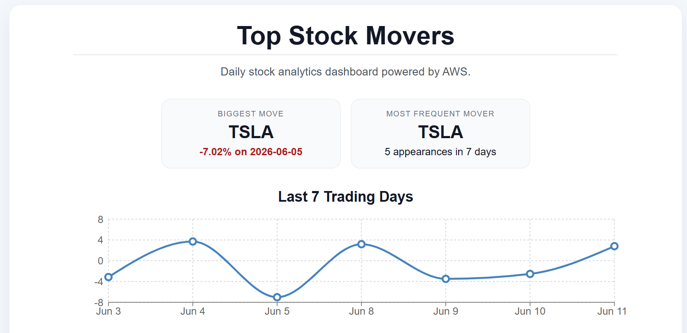
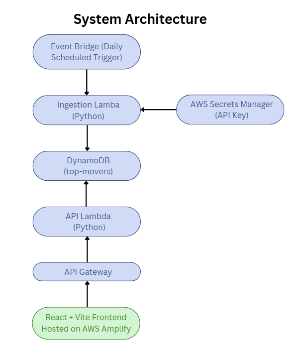

# Serverless Stock Analytics Dashboard

A serverless stock analytics dashboard built with React, Python, and AWS that automatically ingests market data, stores historical results, and visualizes the last seven trading days through an interactive web interface.

<h2>Dashboard Preview</h2>



<h2>System Architecture</h2>



The application uses a serverless architecture where EventBridge triggers a scheduled ingestion Lambda to retrieve stock data securely using AWS Secrets Manager. Results are stored in DynamoDB and served through API Gateway and a separate API Lambda to the React frontend hosted on AWS Amplify.

## Features

- Automatically identifies the stock with the largest daily percentage change from a watchlist.
- Stores historical results in Amazon DynamoDB.
- Automated daily data ingestion using Amazon EventBridge and AWS Lambda.
- Displays the last seven trading days in an interactive React dashboard.
- Includes a trend visualization with a line chart.
- Highlights the biggest move and most frequent mover over the displayed period.
- Secure API key management with AWS Secrets Manager.
- Hosted as a static web application using AWS Amplify.
- Automated infrastructure deployment using GitHub Actions and AWS CDK.

## Tech Stack

- React + Vite
- Python
- AWS Lambda
- Amazon API Gateway
- Amazon DynamoDB
- Amazon EventBridge
- AWS Secrets Manager
- AWS Amplify
- AWS CDK
- GitHub Actions

## CI/CD

This project uses GitHub Actions to automate backend infrastructure deployments. Changes to the infrastructure or backend code trigger a workflow that installs dependencies, synthesizes the AWS CDK application, and deploys updates automatically.

## Security

- API credentials are stored securely in AWS Secrets Manager.
- Secrets are retrieved at runtime by the ingestion Lambda using IAM permissions.
- Sensitive credentials are not committed to source control.
- API responses include appropriate HTTP headers and cache directives.

## Project Structure

backend/
     api/
     ingestion/

frontend/
     src/

infra/
     AWS CDK Infrastructure

## Running Locally

### Frontend

```bash
cd frontend
npm install
npm run dev
```

### Infrastructure

```bash
cd infra
cdk deploy
```

## Dashboard

The dashboard provides:

- A 7-trading-day historical view of tracked stock movements.
- Interactive visualization of percentage changes.
- Summary statistics for the biggest move and most frequent mover.
- A detailed historical data table for analysis.

## Future Improvements

- GitHub Actions CI/CD for automated backend deployments.
- Additional analytics and historical filtering.
- Expanded watchlists and configurable tracking.

